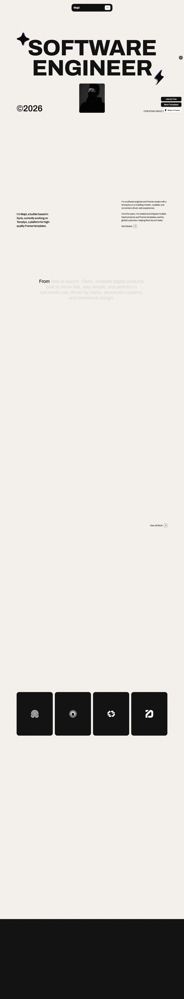
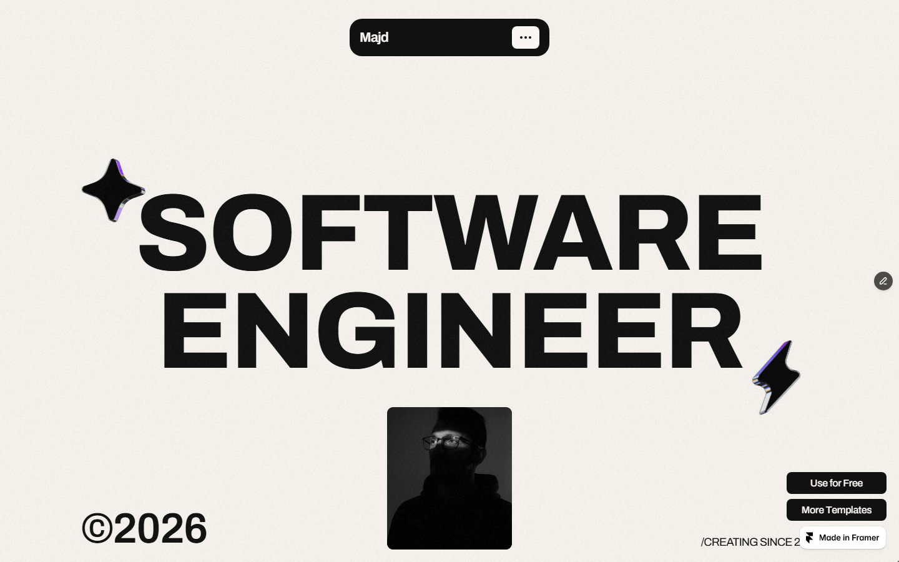
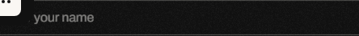

# basic-lots-091646 Design System

You are building UI for **basic-lots-091646**. Light-themed, cool palette, sans-serif typography (Archivo), compact density on a 4px grid.

## Visual Reference

**IMPORTANT**: Study ALL screenshots below before writing any UI. Match colors, typography, spacing, layout, and motion exactly as shown.

### Homepage


### Scroll Journey (Cinematic Visual States)

> These screenshots capture the website at different scroll depths. The design changes dramatically as you scroll — each frame shows a different cinematic state. Replicate these exact visual transitions.

#### 0% — Hero / Above the fold


#### 17% — Mid-page at 17% scroll


#### 33% — Mid-page at 33% scroll


#### 50% — Mid-page at 50% scroll


#### 67% — Mid-page at 67% scroll


#### 83% — Mid-page at 83% scroll


#### 100% — Footer / End of page


> Read `references/DESIGN.md` for full token details. Read `references/ANIMATIONS.md` for motion specs. Read `references/LAYOUT.md` for layout structure. Read `references/COMPONENTS.md` for component patterns.

## Ultra Reference Files

This package includes extended documentation. **Read these files before implementing:**

| File | Contents |
|------|----------|
| `references/DESIGN.md` | Full design system tokens, colors, typography, spacing |
| `references/VISUAL_GUIDE.md` | **START HERE** — Master visual guide with all screenshots embedded |
| `references/ANIMATIONS.md` | CSS keyframes, scroll triggers, motion library stack, video specs |
| `references/LAYOUT.md` | Flex/grid containers, page structure, spacing relationships |
| `references/COMPONENTS.md` | DOM component patterns, HTML structure, class fingerprints |
| `references/INTERACTIONS.md` | Hover/focus states with before/after style diffs |
| `screens/scroll/` | 7 scroll journey screenshots showing cinematic states |

### Animation Stack Detected

- **Web Animations API (2 active)** — animation

## Design Philosophy

- **Layered depth** — use shadow tokens to create a sense of physical layering. Each elevation level has a specific shadow.
- **Solid colors only** — no gradients anywhere. Every surface is a single flat color.
- **Type pairing** — Archivo for body/UI text, Inter for headings/display. Never introduce a third typeface.
- **compact density** — 4px base grid. Every dimension is a multiple of 4.
- **cool palette** — the color temperature runs cool, matching the sans-serif typography.
- **Restrained accent** — `#0099ff` is the only pop of color. Used exclusively for CTAs, links, focus rings, and active states.
- **Subtle motion** — transitions smooth state changes. Keep durations under 300ms, use ease-out curves.

## Color System

### Core Palette

| Role | Token | Hex | Use |
|------|-------|-----|-----|
| Background | `--background` | `#ffffff` | Page/app background |
| Surface | `--surface` | `#faf7f3` | Cards, panels, modals |
| Text Primary | `--text-primary` | `#000000` | Headings, body text |
| Text Muted | `--text-muted` | `#767676` | Captions, placeholders |
| Accent | `--accent` | `#0099ff` | CTAs, links, focus rings |
| Border | `--border` | `#545454` | Dividers, card borders |

### Extended Palette

- `#111111` — Deep background layer or shadow color
- `#0000ee`
- **framer-input-icon-color:** `#999999`

### CSS Variable Tokens

```css
--framer-text-background-color: initial;
--framer-text-background-radius: initial;
--framer-text-background-corner-shape: initial;
--framer-text-background-padding: initial;
--framer-input-border-bottom-width: 1px;
--framer-input-border-left-width: 1px;
--framer-input-border-radius-bottom-left: 12px;
--framer-input-border-radius-bottom-right: 12px;
--framer-input-border-radius-top-left: 12px;
--framer-input-border-radius-top-right: 12px;
--framer-input-border-right-width: 1px;
--framer-input-border-style: solid;
--framer-input-border-top-width: 1px;
--framer-input-focused-border-style: solid;
--framer-input-focused-border-width: 1px 1px 1px 1px;
--framer-input-border-bottom-width: 1px;
--framer-input-border-left-width: 1px;
--framer-input-border-radius-bottom-left: 12px;
--framer-input-border-radius-bottom-right: 12px;
--framer-input-border-radius-top-left: 12px;
```

## Typography

### Font Stack

- **Archivo** — Heading 1, Heading 2, Heading 3
- **Inter** — Body, Caption

### Font Sources

```css
@font-face {
  font-family: "Inter";
  src: url("fonts/Inter-Bold.ttf") format("truetype");
  font-weight: 700;
}
@font-face {
  font-family: "Inter";
  src: url("fonts/Inter-Regular.ttf") format("truetype");
  font-weight: 400;
}
@font-face {
  font-family: "Archivo";
  src: url("fonts/Archivo-Bold.ttf") format("truetype");
  font-weight: 700;
}
@font-face {
  font-family: "Archivo";
  src: url("fonts/Archivo-Regular.ttf") format("truetype");
  font-weight: 400;
}
@font-face {
  font-family: "Clash Grotesk";
  src: url("fonts/ClashGrotesk-Regular.woff2") format("woff2");
  font-weight: 400;
}
```

### Type Scale

| Role | Family | Size | Weight |
|------|--------|------|--------|
| Heading 1 | Archivo | calc(var(--framer-blockquote-font-size,var(--framer-font-size,16px))*var(--framer-font-size-scale,1)) | 700 |
| Heading 2 | Archivo | calc(var(--framer-link-hover-font-size,var(--framer-blockquote-font-size,var(--framer-font-size,16px)))*var(--framer-font-size-scale,1)) | 700 |
| Heading 3 | Archivo | calc(var(--framer-link-current-font-size,var(--framer-link-font-size,var(--framer-font-size,16px)))*var(--framer-font-size-scale,1)) | 700 |
| Body | Inter | calc(var(--framer-link-hover-font-size,var(--framer-link-current-font-size,var(--framer-link-font-size,var(--framer-font-size,16px))))*var(--framer-font-size-scale,1)) | 400 |
| Caption | Inter | var(--framer-font-size,16px) | 400 |

### Typography Rules

- Body/UI: **Archivo**, Headings: **Inter** — these are the only display fonts
- Max 3-4 font sizes per screen
- Headings: weight 600-700, body: weight 400
- Use color and opacity for text hierarchy, not additional font sizes
- Line height: 1.5 for body, 1.2 for headings

## Spacing & Layout

### Base Grid: 4px

Every dimension (margin, padding, gap, width, height) must be a multiple of **4px**.

### Spacing Scale

`2, 4, 6, 8, 10, 12, 16, 20, 22, 24, 30, 40` px

### Spacing as Meaning

| Spacing | Use |
|---------|-----|
| 4-8px | Tight: related items (icon + label, avatar + name) |
| 12-16px | Medium: between groups within a section |
| 24-32px | Wide: between distinct sections |
| 48px+ | Vast: major page section breaks |

### Border Radius

Scale: `8px, 12px, 16px, 20px, inherit, 89px, 142px, 226px, 371px`
Default: `inherit`

### Container

Max-width: `1279px`, centered with auto margins.

### Breakpoints

| Name | Value |
|------|-------|
| lg | 809px |
| lg | 809.98px |
| lg | 810px |
| xl | 1279px |
| xl | 1279.98px |
| xl | 1280px |

Mobile-first: design for small screens, layer on responsive overrides.

## Component Patterns

### Card

```css
.card {
  background: #faf7f3;
  border: 1px solid #545454;
  border-radius: inherit;
  padding: 16px;
  box-shadow: var(--framer-input-box-shadow);
}
```

```html
<div class="card">
  <h3>Card Title</h3>
  <p>Card content goes here.</p>
</div>
```

### Button

```css
/* Primary */
.btn-primary {
  background: #0099ff;
  color: #000000;
  border-radius: inherit;
  padding: 8px 16px;
  font-weight: 500;
  transition: opacity 150ms ease;
}
.btn-primary:hover { opacity: 0.9; }

/* Ghost */
.btn-ghost {
  background: transparent;
  border: 1px solid #545454;
  color: #000000;
  border-radius: inherit;
  padding: 8px 16px;
}
```

```html
<button class="btn-primary">Get Started</button>
<button class="btn-ghost">Learn More</button>
```

### Input

```css
.input {
  background: #ffffff;
  border: 1px solid #545454;
  border-radius: inherit;
  padding: 8px 12px;
  color: #000000;
  font-size: 14px;
}
.input:focus { border-color: #0099ff; outline: none; }
```

```html
<input class="input" type="text" placeholder="Search..." />
```

### Badge / Chip

```css
.badge {
  display: inline-flex;
  align-items: center;
  padding: 4px 8px;
  border-radius: 9999px;
  font-size: 12px;
  font-weight: 500;
  background: #faf7f3;
  color: #767676;
}
```

```html
<span class="badge">New</span>
<span class="badge">Beta</span>
```

### Modal / Dialog

```css
.modal-backdrop { background: rgba(0, 0, 0, 0.6); }
.modal {
  background: #faf7f3;
  border: 1px solid #545454;
  border-radius: 371px;
  padding: 24px;
  max-width: 480px;
  width: 90vw;
  box-shadow: var(--framer-input-focused-box-shadow,var(--framer-input-box-shadow));
}
```

```html
<div class="modal-backdrop">
  <div class="modal">
    <h2>Dialog Title</h2>
    <p>Dialog content.</p>
    <button class="btn-primary">Confirm</button>
    <button class="btn-ghost">Cancel</button>
  </div>
</div>
```

### Table

```css
.table { width: 100%; border-collapse: collapse; }
.table th {
  text-align: left;
  padding: 8px 12px;
  font-weight: 500;
  font-size: 12px;
  color: #767676;
  text-transform: uppercase;
  letter-spacing: 0.05em;
  border-bottom: 1px solid #545454;
}
.table td {
  padding: 12px;
  border-bottom: 1px solid #545454;
}
```

```html
<table class="table">
  <thead><tr><th>Name</th><th>Status</th><th>Date</th></tr></thead>
  <tbody>
    <tr><td>Item One</td><td>Active</td><td>Jan 1</td></tr>
    <tr><td>Item Two</td><td>Pending</td><td>Jan 2</td></tr>
  </tbody>
</table>
```

### Navigation

```css
.nav {
  display: flex;
  align-items: center;
  gap: 8px;
  padding: 12px 16px;
  border-bottom: 1px solid #545454;
}
.nav-link {
  color: #767676;
  padding: 8px 12px;
  border-radius: inherit;
  transition: color 150ms;
}
.nav-link:hover { color: #000000; }
.nav-link.active { color: #0099ff; }
```

```html
<nav class="nav">
  <a href="/" class="nav-link active">Home</a>
  <a href="/about" class="nav-link">About</a>
  <a href="/pricing" class="nav-link">Pricing</a>
  <button class="btn-primary" style="margin-left: auto">Get Started</button>
</nav>
```

### Extracted Components

These components were found in the codebase:

**Footer** (`html`)

## Page Structure

The following page sections were detected:

- **Navigation** — Top navigation bar (1 items)
- **Hero** — Hero section (detected from heading structure)
- **Footer** — Page footer with links and info (6 items)

When building pages, follow this section order and structure.

## Animation & Motion

This project uses **subtle motion**. Transitions smooth state changes without calling attention.

### Motion Tokens

- **Duration scale:** `150ms`

### Motion Guidelines

- **Duration:** Use values from the duration scale above. Short (150ms) for micro-interactions, long (150ms) for page transitions
- **Easing:** `ease-out` for enters, `ease-in` for exits
- **Direction:** Elements enter from bottom/right, exit to top/left
- **Reduced motion:** Always respect `prefers-reduced-motion` — disable animations when set

## Depth & Elevation

### Shadow Tokens

- Raised (cards, buttons): `var(--framer-input-box-shadow)`
- Raised (cards, buttons): `var(--framer-input-focused-box-shadow,var(--framer-input-box-shadow))`

### Z-Index Scale

`0, 1, 8, 10`

Use these exact values — never invent z-index values.

## Anti-Patterns (Never Do)

- **No gradients** — solid colors only, everywhere
- **No blur effects** — no backdrop-blur, no filter: blur()
- **No zebra striping** — tables and lists use borders for separation
- **No invented colors** — every hex value must come from the palette above
- **No arbitrary spacing** — every dimension is a multiple of 4px
- **No extra fonts** — only Archivo and Inter are allowed
- **No arbitrary border-radius** — use the scale: 8px, 12px, 16px, 20px, 89px, 142px, 226px, 371px
- **No opacity for disabled states** — use muted colors instead
- **No pill shapes** — this design doesn't use rounded-full / 9999px radius

## Workflow

1. **Read** `references/DESIGN.md` before writing any UI code
2. **Pick colors** from the Color System section — never invent new ones
3. **Set typography** — Archivo, Inter only, using the type scale
4. **Build layout** on the 4px grid — check every margin, padding, gap
5. **Match components** to patterns above before creating new ones
6. **Apply elevation** — use shadow tokens
7. **Validate** — every value traces back to a design token. No magic numbers.

## Brand Spec

- **Favicon:** `https://framerusercontent.com/images/2A4lf8gU9etLcIDR9C9ORxNgks.png`
- **Site URL:** `https://basic-lots-091646.framer.app/`
- **Brand color:** `#0099ff`
- **Brand typeface:** Archivo

## Quick Reference

```
Background:     #ffffff
Surface:        #faf7f3
Text:           #000000 / #767676
Accent:         #0099ff
Border:         #545454
Font:           Archivo
Spacing:        4px grid
Radius:         inherit
Components:     7 detected
```

## When to Trigger

Activate this skill when:
- Creating new components, pages, or visual elements for basic-lots-091646
- Writing CSS, Tailwind classes, styled-components, or inline styles
- Building page layouts, templates, or responsive designs
- Reviewing UI code for design consistency
- The user mentions "basic-lots-091646" design, style, UI, or theme
- Generating mockups, wireframes, or visual prototypes

---

# Full Reference Files

> Every output file is embedded below. Claude has full design system context from /skills alone.

## Design System Tokens (DESIGN.md)

# basic-lots-091646 DESIGN.md

> Auto-generated design system — reverse-engineered via static analysis by skillui.
> Frameworks: None detected
> Colors: 9 · Fonts: 2 · Components: 7
> Icon library: not detected · State: not detected
> Primary theme: light · Dark mode toggle: no · Motion: subtle

## Visual Reference

**Match this design exactly** — study colors, fonts, spacing, and component shapes before writing any UI code.


---

## 1. Visual Theme & Atmosphere

This is a **light-themed** interface with a cool, approachable feel. The light background emphasizes content clarity. Typography pairs **Inter** for display/headings with **Archivo** for body text, creating clear visual hierarchy through type contrast. Spacing follows a **4px base grid** (compact density), with scale: 2, 4, 6, 8, 10, 12, 16, 20px. The palette is predominantly monochromatic with **#0099ff** as the single accent color — used sparingly for interactive elements and emphasis. Motion is subtle — smooth transitions (150-300ms) ease state changes without drawing attention.

---

## 2. Color Palette & Roles

| Token | Hex | Role | Use |
|---|---|---|---|
| background | `#ffffff` | background | Page background, darkest surface |
| surface | `#faf7f3` | surface | Card and panel backgrounds |
| framer-text-color | `#000000` | text-primary | Headings and body text |
| text-muted | `#767676` | text-muted | Captions, placeholders, secondary info |
| border | `#545454` | border | Dividers, card borders, outlines |
| framer-link-text-color | `#0099ff` | accent | CTAs, links, focus rings, active states |
| info | `#0000ee` | info | Informational highlights |
| unknown | `#111111` | unknown | Palette color |
| framer-input-icon-color | `#999999` | unknown | Palette color |

### CSS Variable Tokens

```css
--framer-text-background-color: initial;
--framer-text-background-radius: initial;
--framer-text-background-corner-shape: initial;
--framer-text-background-padding: initial;
--framer-input-border-bottom-width: 1px;
--framer-input-border-left-width: 1px;
--framer-input-border-radius-bottom-left: 12px;
--framer-input-border-radius-bottom-right: 12px;
--framer-input-border-radius-top-left: 12px;
--framer-input-border-radius-top-right: 12px;
--framer-input-border-right-width: 1px;
--framer-input-border-style: solid;
--framer-input-border-top-width: 1px;
--framer-input-focused-border-style: solid;
--framer-input-focused-border-width: 1px 1px 1px 1px;
--framer-input-border-bottom-width: 1px;
--framer-input-border-left-width: 1px;
--framer-input-border-radius-bottom-left: 12px;
--framer-input-border-radius-bottom-right: 12px;
--framer-input-border-radius-top-left: 12px;
```


---

## 3. Typography Rules

**Font Stack:**
- **Archivo** — Heading 1, Heading 2, Heading 3
- **Inter** — Body, Caption

**Font Sources:**

```css
@font-face {
  font-family: "Inter";
  src: url("fonts/Inter-Bold.ttf") format("truetype");
  font-weight: 700;
}
@font-face {
  font-family: "Inter";
  src: url("fonts/Inter-Regular.ttf") format("truetype");
  font-weight: 400;
}
@font-face {
  font-family: "Archivo";
  src: url("fonts/Archivo-Bold.ttf") format("truetype");
  font-weight: 700;
}
@font-face {
  font-family: "Archivo";
  src: url("fonts/Archivo-Regular.ttf") format("truetype");
  font-weight: 400;
}
@font-face {
  font-family: "Clash Grotesk";
  src: url("fonts/ClashGrotesk-Regular.woff2") format("woff2");
  font-weight: 400;
}
```

| Role | Font | Size | Weight |
|---|---|---|---|
| Heading 1 | Archivo | calc(var(--framer-blockquote-font-size,var(--framer-font-size,16px))*var(--framer-font-size-scale,1)) | 700 |
| Heading 2 | Archivo | calc(var(--framer-link-hover-font-size,var(--framer-blockquote-font-size,var(--framer-font-size,16px)))*var(--framer-font-size-scale,1)) | 700 |
| Heading 3 | Archivo | calc(var(--framer-link-current-font-size,var(--framer-link-font-size,var(--framer-font-size,16px)))*var(--framer-font-size-scale,1)) | 700 |
| Body | Inter | calc(var(--framer-link-hover-font-size,var(--framer-link-current-font-size,var(--framer-link-font-size,var(--framer-font-size,16px))))*var(--framer-font-size-scale,1)) | 400 |
| Caption | Inter | var(--framer-font-size,16px) | 400 |

**Typographic Rules:**
- Limit to 2 font families max per screen
- Use **Archivo** for body/UI text, **Inter** for display/headings
- Maintain consistent hierarchy: no more than 3-4 font sizes per screen
- Headings use bold (600-700), body uses regular (400)
- Line height: 1.5 for body text, 1.2 for headings
- Use color and opacity for secondary hierarchy, not additional font sizes


---

## 4. Component Stylings

### Layout (1)

**Footer** — `html`

### Navigation (1)

**Navigation** — `html`

### Data Display (1)

**Badge** — `html`

### Data Input (2)

**Button** — `html`

**Input** — `html`
- State: :focus, :placeholder

### Media (2)

**Image** — `html`

**Icon** — `html`


---

## 5. Layout Principles

- **Base spacing unit:** 4px
- **Spacing scale:** 2, 4, 6, 8, 10, 12, 16, 20, 22, 24, 30, 40
- **Border radius:** 8px, 12px, 16px, 20px, inherit, 89px, 142px, 226px, 371px
- **Max content width:** 1279px

**Spacing as Meaning:**
| Spacing | Use |
|---|---|
| 4-8px | Tight: related items within a group |
| 12-16px | Medium: between groups |
| 24-32px | Wide: between sections |
| 48px+ | Vast: major section breaks |


---

## 6. Depth & Elevation

### Raised — cards, buttons, interactive elements

- `var(--framer-input-box-shadow)`
- `var(--framer-input-focused-box-shadow,var(--framer-input-box-shadow))`

### Z-Index Scale

`0, 1, 8, 10`


---

## 7. Animation & Motion

This project uses **subtle motion**. Transitions smooth state changes without demanding attention.

### Motion Guidelines

- Duration: 150-300ms for micro-interactions, 300-500ms for page transitions
- Easing: `ease-out` for enters, `ease-in` for exits
- Always respect `prefers-reduced-motion`


---

## 8. Do's and Don'ts

### Do's

- Use `#0099ff` for interactive elements (buttons, links, focus rings)
- Use `#ffffff` as the primary page background
- Pair **Archivo** (body) with **Inter** (display) — these are the only allowed fonts
- Follow the **4px** spacing grid for all margins, padding, and gaps
- Use the defined shadow tokens for elevation — see Section 6
- Use border-radius from the scale: 8px, 12px, 16px, 20px, inherit
- Reuse existing components from Section 4 before creating new ones

### Don'ts

- Don't introduce colors outside this palette — extend the design tokens first
- Don't introduce additional font families beyond Archivo and Inter
- Don't use arbitrary spacing values — stick to multiples of 4px
- Don't create custom box-shadow values outside the system tokens
- Don't use gradients — the design uses solid colors only
- Don't use arbitrary border-radius values — pick from the defined scale
- Don't duplicate component patterns — check Section 4 first
- Don't use backdrop-blur or blur effects

### Anti-Patterns (detected from codebase)

- No gradient backgrounds
- No blur or backdrop-blur effects
- No zebra striping on tables/lists


---

## 9. Responsive Behavior

| Name | Value | Source |
|---|---|---|
| lg | 809px | css |
| lg | 809.98px | css |
| lg | 810px | css |
| xl | 1279px | css |
| xl | 1279.98px | css |
| xl | 1280px | css |

**Approach:** Use `@media (min-width: ...)` queries matching the breakpoints above.


---

## 10. Agent Prompt Guide

Use these as starting points when building new UI:

### Build a Card

```
Background: #faf7f3
Border: 1px solid #545454
Radius: inherit
Padding: 16px
Font: Archivo
Use shadow tokens from Section 6.
```

### Build a Button

```
Primary: bg #0099ff, text white
Ghost: bg transparent, border #545454
Padding: 8px 16px
Radius: inherit
Hover: opacity 0.9 or lighter shade
Focus: ring with #0099ff
```

### Build a Page Layout

```
Background: #ffffff
Max-width: 1279px, centered
Grid: 4px base
Responsive: mobile-first, breakpoints from Section 9
```

### Build a Stats Card

```
Surface: #faf7f3
Label: #767676 (muted, 12px, uppercase)
Value: #000000 (primary, 24-32px, bold)
Status: use success/warning/danger from Section 2
```

### Build a Form

```
Input bg: #ffffff
Input border: 1px solid #545454
Focus: border-color #0099ff
Label: #767676 12px
Spacing: 16px between fields
Radius: inherit
```

### General Component

```
1. Read DESIGN.md Sections 2-6 for tokens
2. Colors: only from palette
3. Font: Archivo, type scale from Section 3
4. Spacing: 4px grid
5. Components: match patterns from Section 4
6. Elevation: shadow tokens
```

## Visual Guide — Screenshots (VISUAL_GUIDE.md)

# basic-lots-091646 — Visual Guide

> Master visual reference. Study every screenshot carefully before implementing any UI.
> Match colors, layout, typography, spacing, and motion states exactly.

**Motion Stack:** **Web Animations API (2 active)**

## Scroll Journey

The page has cinematic scroll animations. Each screenshot below shows the exact visual state at that scroll depth.
**Replicate these transitions precisely** — the design changes dramatically as you scroll.

### Hero — Above the fold

*Scroll position: 0px of 7798px total*


### 17% scroll depth

*Scroll position: 1173px of 7798px total*


### 33% scroll depth

*Scroll position: 2276px of 7798px total*


### 50% scroll depth

*Scroll position: 3449px of 7798px total*


### 67% scroll depth

*Scroll position: 4622px of 7798px total*


### 83% scroll depth

*Scroll position: 5725px of 7798px total*


### Footer — End of page

*Scroll position: 6898px of 7798px total*


## Full Page Screenshots

### Majd

*URL: `https://basic-lots-091646.framer.app/`*


## Section Screenshots

Clipped sections showing individual components in context.

### Section 1 — `section`

*1440×900px*


## Animations & Motion (ANIMATIONS.md)

# Animation Reference

> Cinematic motion design extracted from live DOM. Follow these specs exactly to recreate the experience.

## Motion Technology Stack

| Library | Type | Notes |
|---------|------|-------|
| **Web Animations API (2 active)** | animation |  |

## Scroll Journey

The page is **7,798px** tall. Each frame below shows what the user sees at that scroll depth.

> **Use these screenshots to understand WHAT animates, WHEN it animates, and HOW it moves.**

### 0% — Top / Hero
Scroll position: 0px


### 17% — Opening Section
Scroll position: 1,173px


### 33% — First Feature Section
Scroll position: 2,276px


### 50% — Mid-Page
Scroll position: 3,449px


### 67% — Lower Content
Scroll position: 4,622px


### 83% — Near Footer
Scroll position: 5,725px


### 100% — Bottom / Footer
Scroll position: 6,898px


## CSS Keyframes (1 extracted)

### `@keyframes __framer-loading-spin`

Duration: `800ms` · Easing: `linear` · Iteration: `infinite`

Used by: `#__framer-editorbar-loading-spinner`

```css
@keyframes __framer-loading-spin {
  0% {
    transform: rotate(0deg);
  }
  100% {
    transform: rotate(360deg);
  }
}
```

> Transform/motion animation

## Global Transition Declarations

These `transition` values were extracted from CSS rules across the site:

```css
transition: color 0.15s;
transition: opacity 0.4s ease-out;
transition: unset;
```

## How to Recreate This Motion Design

### Step 1 — Install Dependencies

```bash
```

### Step 2 — Scroll-Reveal Pattern

Elements that animate into view follow this pattern:

```css
/* Initial hidden state */
.reveal {
  opacity: 0;
  transform: translateY(40px);
  transition: opacity 0.15s cubic-bezier(0.4, 0, 0.2, 1),
              transform 0.15s cubic-bezier(0.4, 0, 0.2, 1);
}
.reveal.visible {
  opacity: 1;
  transform: translateY(0);
}
```

### Step 3 — Key Motion Principles

- **Duration scale:** `0.15s` · `0.4s` — use these values, never invent new durations
- **Always add** `@media (prefers-reduced-motion: reduce) { * { animation-duration: 0.01ms !important; transition-duration: 0.01ms !important; } }`

### Step 4 — Scroll Journey Reference

Match what happens at each scroll position:

- **0%** (`0px`) → `screens/scroll/scroll-000.png`
- **17%** (`1173px`) → `screens/scroll/scroll-017.png`
- **33%** (`2276px`) → `screens/scroll/scroll-033.png`
- **50%** (`3449px`) → `screens/scroll/scroll-050.png`
- **67%** (`4622px`) → `screens/scroll/scroll-067.png`
- **83%** (`5725px`) → `screens/scroll/scroll-083.png`
- **100%** (`6898px`) → `screens/scroll/scroll-100.png`

## Layout & Grid (LAYOUT.md)

# Layout Reference

> Auto-extracted from live DOM. Use this to understand how the site is structured spatially.

## Spacing System

**Base grid:** 4px

**Scale:** `2, 4, 6, 8, 10, 12, 16, 20, 22, 24, 30, 40, 44, 48, 50` px

| Spacing | Semantic Use |
|---------|-------------|
| 4px | Tight — within a component |
| 8px | Medium — between sibling items |
| 16px | Wide — between sections |
| 32px | Vast — major section breaks |

## Flex Layouts

| Element | Direction | Justify | Align | Gap | Children |
|---------|-----------|---------|-------|-----|----------|
| `main.framer-1n1z6hi` | column | center | center | 10px | 7 |
| `nav.framer-HdeBz.framer-3C8PO` | column | center | center | 10px | 1 |
| `footer.framer-soKIl.framer-R6rCf` | row | center | center | 10px | 2 |
| `section.framer-lcc4ld` | column | center | center | 10px | 1 |
| `section#services.framer-1bgnipk` | row | center | center | 10px | 1 |
| `section.framer-1ut795m` | row | center | center | 10px | 1 |
| `section.framer-1nq91on` | row | center | center | 10px | 1 |
| `section.framer-141no99` | row | center | center | 10px | 1 |
| `section#contact.framer-9u1bc5` | row | center | center | 10px | 1 |
| `section#hero-section.framer-1dddyte` | row | center | center | 10px | 1 |
| `section#bio-section.framer-m00iei` | row | center | end | 10px | 1 |
| `div.framer-form-text-input.framer-form-input-wrapper` | row | — | center | — | 1 |
| `div.framer-form-text-input.framer-form-input-wrapper` | row | — | center | — | 1 |
| `div.framer-form-text-input.framer-form-input-wrapper` | row | — | center | — | 1 |

## Structural Containers

### `<main>` (`main.framer-1n1z6hi`)

```
display:          flex
flex-direction:   column
justify-content:  center
align-items:      center
gap:              10px
children:         7
```

### `<nav>` (`nav.framer-HdeBz.framer-3C8PO`)

```
display:          flex
flex-direction:   column
justify-content:  center
align-items:      center
gap:              10px
children:         1
```

### `<footer>` (`footer.framer-soKIl.framer-R6rCf`)

```
display:          flex
flex-direction:   row
justify-content:  center
align-items:      center
gap:              10px
padding:          120px 0px 300px
children:         2
```

### `<section>` (`section.framer-lcc4ld`)

```
display:          flex
flex-direction:   column
justify-content:  center
align-items:      center
gap:              10px
children:         1
```

### `<section>` (`section#services.framer-1bgnipk`)

```
display:          flex
flex-direction:   row
justify-content:  center
align-items:      center
gap:              10px
children:         1
```

### `<section>` (`section.framer-1ut795m`)

```
display:          flex
flex-direction:   row
justify-content:  center
align-items:      center
gap:              10px
padding:          120px 0px 0px
children:         1
```

### `<section>` (`section.framer-1nq91on`)

```
display:          flex
flex-direction:   row
justify-content:  center
align-items:      center
gap:              10px
padding:          120px 0px 0px
children:         1
```

### `<section>` (`section.framer-141no99`)

```
display:          flex
flex-direction:   row
justify-content:  center
align-items:      center
gap:              10px
padding:          120px 0px 0px
children:         1
```

### `<section>` (`section#contact.framer-9u1bc5`)

```
display:          flex
flex-direction:   row
justify-content:  center
align-items:      center
gap:              10px
padding:          120px 0px
children:         1
```

### `<section>` (`section#hero-section.framer-1dddyte`)

```
display:          flex
flex-direction:   row
justify-content:  center
align-items:      center
gap:              10px
children:         1
```

### `<section>` (`section#bio-section.framer-m00iei`)

```
display:          flex
flex-direction:   row
justify-content:  center
align-items:      end
gap:              10px
children:         1
```

## Layout Rules

- **Container max-width:** `840px` — always center with `margin: auto`
- Primary layout system: **Flexbox**
- Every spacing value must be a multiple of **4px**
- Never use arbitrary margin/padding values outside the spacing scale

## Component Patterns (COMPONENTS.md)

# Component Reference

> Repeated DOM patterns detected by structural analysis. Each component appeared 3+ times.

## Detected Components

| Component | Category | Instances | Key Classes |
|-----------|----------|-----------|-------------|
| **Framer Styles Preset 8qcqpn** | unknown | 21× | `.framer-styles-preset-8qcqpn`, `.framer-text` |
| **Framer Styles Preset 18hoqs7** | unknown | 14× | `.framer-styles-preset-18hoqs7`, `.framer-text` |
| **Framer Styles Preset Jtzju9** | unknown | 10× | `.framer-styles-preset-jtzju9`, `.framer-text` |
| **Framer Styles Preset Izeex** | unknown | 4× | `.framer-styles-preset-izeex`, `.framer-text` |
| **Framer 4gO8g** | unknown | 4× | `.framer-4gO8g`, `.framer-N1dSz`, `.framer-v-zo8nwq` |
| **Framer 1s0oqn3** | unknown | 4× | `.framer-1s0oqn3` |
| **Framer 1jrotr0** | unknown | 4× | `.framer-1jrotr0` |
| **Framer X4k8oa** | unknown | 4× | `.framer-x4k8oa` |
| **Framer 1dvkwdb** | unknown | 4× | `.framer-1dvkwdb` |
| **Framer 1eaeiv5** | unknown | 4× | `.framer-1eaeiv5` |
| **Framer 19xgbbo Container** | unknown | 4× | `.framer-19xgbbo-container` |
| **Framer 32eq8k** | unknown | 4× | `.framer-32eq8k`, `.framer-RX6DT`, `.framer-cZC2Y` |
| **Framer Q8laq2** | unknown | 4× | `.framer-q8laq2` |
| **Framer K1u9sl** | unknown | 4× | `.framer-k1u9sl` |
| **Framer 1a1g2uv** | unknown | 4× | `.framer-1a1g2uv` |
| **Framer V4eg3f** | unknown | 4× | `.framer-v4eg3f` |
| **Framer 1eobfit** | unknown | 4× | `.framer-1eobfit` |
| **Framer 118v47e** | unknown | 4× | `.framer-118v47e`, `.framer-N1dSz`, `.framer-cZC2Y` |
| **Framer 1jei1zo** | unknown | 3× | `.framer-1jei1zo`, `.framer-N1dSz`, `.framer-f4qgyi` |
| **Framer 5piecp** | unknown | 3× | `.framer-5piecp` |

## Other Components

### Framer Styles Preset 8qcqpn

**Instances found:** 21

**CSS classes:** `.framer-styles-preset-8qcqpn` `.framer-text`

**HTML structure:**

```html
<p class="framer-text framer-styles-preset-8qcqpn" data-styles-preset="e4lWfIAXv" dir="auto">I’m a software engineer and Framer creator with a strong focus on building modern, scalable, and conversion-driven web experiences. </p>
```

**Base styles (from design tokens):**

```css
.framer-styles-preset-8qcqpn {
  background: #faf7f3;
  padding: 4px;
}```

### Framer Styles Preset 18hoqs7

**Instances found:** 14

**CSS classes:** `.framer-styles-preset-18hoqs7` `.framer-text`

**HTML structure:**

```html
<p class="framer-text framer-styles-preset-18hoqs7" data-styles-preset="JW7_JT3Q0" dir="auto">Agency Framer Template</p>
```

**Base styles (from design tokens):**

```css
.framer-styles-preset-18hoqs7 {
  background: #faf7f3;
  padding: 4px;
}```

### Framer Styles Preset Jtzju9

**Instances found:** 10

**CSS classes:** `.framer-styles-preset-jtzju9` `.framer-text`

**HTML structure:**

```html
<h3 class="framer-text framer-styles-preset-jtzju9" data-styles-preset="sJTxBXgD6" dir="auto" style="--framer-text-color:var(--extracted-a0htzi, var(--token-e44374f3-0aa3-4326-a0ec-25df52a31057, rgb(17, 17, 17)))">Website Migration</h3>
```

**Base styles (from design tokens):**

```css
.framer-styles-preset-jtzju9 {
  background: #faf7f3;
  padding: 4px;
}```

### Framer Styles Preset Izeex

**Instances found:** 4

**CSS classes:** `.framer-styles-preset-izeex` `.framer-text`

**HTML structure:**

```html
<h2 class="framer-text framer-styles-preset-izeex" data-styles-preset="DBxp0bzr3" dir="auto"><span style="display:inline-block;opacity:0.001;filter:blur(10px);transform:translateX(0px) translateY(10px) scale(1) rotate(0deg) skewX(0deg) skewY(0deg)">Hey!</span></h2>
```

**Base styles (from design tokens):**

```css
.framer-styles-preset-izeex {
  background: #faf7f3;
  padding: 4px;
}```

### Framer 4gO8g

**Instances found:** 4

**CSS classes:** `.framer-4gO8g` `.framer-N1dSz` `.framer-v-zo8nwq` `.framer-zo8nwq` `.framer-zr0hx`

**HTML structure:**

```html
<div class="framer-4gO8g framer-zr0hx framer-N1dSz framer-zo8nwq framer-v-zo8nwq" data-border="true" data-framer-name="Desktop" style="--border-bottom-width: 1px; --border-color: var(--token-050a7e9f-40b2-4d5e-8e58-10c5e629e538, rgba(0, 0, 0, 0.1)); --border-left-width: 0px; --border-right-width: 0px; --border-style: solid; --border-top-width: 0px; background-color: var(--token-2fcd1089-c4fe-44ec-8e47-1defe3c9bd50, rgb(250, 247, 243)); width: 100%; opacity: 1;"><div class="framer-1s0oqn3" data-framer-component-type="RichTextContainer" style="--extracted-a0htzi: var(--token-e44374f3-0aa3-4326-a
```

**Base styles (from design tokens):**

```css
.framer-4gO8g {
  background: #faf7f3;
  padding: 4px;
}```

### Framer 1s0oqn3

**Instances found:** 4

**CSS classes:** `.framer-1s0oqn3`

**HTML structure:**

```html
<div class="framer-1s0oqn3" data-framer-component-type="RichTextContainer" style="--extracted-a0htzi: var(--token-e44374f3-0aa3-4326-a0ec-25df52a31057, rgb(17, 17, 17)); --framer-link-text-color: rgb(0, 153, 255); --framer-link-text-decoration: underline; transform: none; opacity: 1;"><h3 class="framer-text framer-styles-preset-jtzju9" data-styles-preset="sJTxBXgD6" dir="auto" style="--framer-text-color:var(--extracted-a0htzi, var(--token-e44374f3-0aa3-4326-a0ec-25df52a31057, rgb(17, 17, 17)))">Website Migration</h3></div>
```

**Base styles (from design tokens):**

```css
.framer-1s0oqn3 {
  background: #faf7f3;
  padding: 4px;
}```

### Framer 1jrotr0

**Instances found:** 4

**CSS classes:** `.framer-1jrotr0`

**HTML structure:**

```html
<div class="framer-1jrotr0" data-framer-name="Categories" style="opacity: 1;"><div class="framer-x4k8oa" data-framer-component-type="RichTextContainer" style="--extracted-r6o4lv: var(--token-fd5eaaad-cf25-4e7f-b54f-37a28b7e1282, rgba(0, 0, 0, 0.5)); --framer-link-text-color: rgb(0, 153, 255); --framer-link-text-decoration: underline; transform: none; opacity: 1;"><p class="framer-text framer-styles-preset-8qcqpn" data-styles-preset="e4lWfIAXv" dir="auto" style="--framer-text-color:var(--extracted-r6o4lv, var(--token-fd5eaaad-cf25-4e7f-b54f-37a28b7e1282, rgba(0, 0, 0, 0.5)))">Web Migration</p><
```

**Base styles (from design tokens):**

```css
.framer-1jrotr0 {
  background: #faf7f3;
  padding: 4px;
}```

### Framer X4k8oa

**Instances found:** 4

**CSS classes:** `.framer-x4k8oa`

**HTML structure:**

```html
<div class="framer-x4k8oa" data-framer-component-type="RichTextContainer" style="--extracted-r6o4lv: var(--token-fd5eaaad-cf25-4e7f-b54f-37a28b7e1282, rgba(0, 0, 0, 0.5)); --framer-link-text-color: rgb(0, 153, 255); --framer-link-text-decoration: underline; transform: none; opacity: 1;"><p class="framer-text framer-styles-preset-8qcqpn" data-styles-preset="e4lWfIAXv" dir="auto" style="--framer-text-color:var(--extracted-r6o4lv, var(--token-fd5eaaad-cf25-4e7f-b54f-37a28b7e1282, rgba(0, 0, 0, 0.5)))">Web Migration</p></div>
```

**Base styles (from design tokens):**

```css
.framer-x4k8oa {
  background: #faf7f3;
  padding: 4px;
}```

### Framer 1dvkwdb

**Instances found:** 4

**CSS classes:** `.framer-1dvkwdb`

**HTML structure:**

```html
<div class="framer-1dvkwdb" data-framer-component-type="RichTextContainer" style="--extracted-r6o4lv: var(--token-fd5eaaad-cf25-4e7f-b54f-37a28b7e1282, rgba(0, 0, 0, 0.5)); --framer-link-text-color: rgb(0, 153, 255); --framer-link-text-decoration: underline; transform: none; opacity: 1;"><p class="framer-text framer-styles-preset-8qcqpn" data-styles-preset="e4lWfIAXv" dir="auto" style="--framer-text-color:var(--extracted-r6o4lv, var(--token-fd5eaaad-cf25-4e7f-b54f-37a28b7e1282, rgba(0, 0, 0, 0.5)))">Optimization</p></div>
```

**Base styles (from design tokens):**

```css
.framer-1dvkwdb {
  background: #faf7f3;
  padding: 4px;
}```

### Framer 1eaeiv5

**Instances found:** 4

**CSS classes:** `.framer-1eaeiv5`

**HTML structure:**

```html
<div class="framer-1eaeiv5" data-framer-component-type="RichTextContainer" style="--extracted-r6o4lv: var(--token-fd5eaaad-cf25-4e7f-b54f-37a28b7e1282, rgba(0, 0, 0, 0.5)); --framer-link-text-color: rgb(0, 153, 255); --framer-link-text-decoration: underline; transform: none; opacity: 1;"><p class="framer-text framer-styles-preset-8qcqpn" data-styles-preset="e4lWfIAXv" dir="auto" style="--framer-text-color:var(--extracted-r6o4lv, var(--token-fd5eaaad-cf25-4e7f-b54f-37a28b7e1282, rgba(0, 0, 0, 0.5)))">Framer Rebuild</p></div>
```

**Base styles (from design tokens):**

```css
.framer-1eaeiv5 {
  background: #faf7f3;
  padding: 4px;
}```

### Framer 19xgbbo Container

**Instances found:** 4

**CSS classes:** `.framer-19xgbbo-container`

**HTML structure:**

```html
<div class="framer-19xgbbo-container" style="will-change:transform;opacity:0;transform:translateY(20px)"><!--$--><a class="framer-RX6DT framer-zr0hx framer-cZC2Y framer-32eq8k framer-v-32eq8k framer-of3aj6" data-framer-name="Project Card" href="./work/damas#work-section" style="background-color: rgba(255, 255, 255, 0); width: 100%; opacity: 1;"><div class="framer-q8laq2" data-framer-name="Image Wrap" style="border-radius: 20px; opacity: 1;"><div class="framer-k1u9sl" data-framer-name="Image" style="border-radius: 20px; opacity: 1;"><div style="position:absolute;border-radius:inherit;corner-sha
```

**Base styles (from design tokens):**

```css
.framer-19xgbbo-container {
  background: #faf7f3;
  padding: 4px;
}```

### Framer 32eq8k

**Instances found:** 4

**CSS classes:** `.framer-32eq8k` `.framer-RX6DT` `.framer-cZC2Y` `.framer-of3aj6` `.framer-v-32eq8k` `.framer-zr0hx`

**HTML structure:**

```html
<a class="framer-RX6DT framer-zr0hx framer-cZC2Y framer-32eq8k framer-v-32eq8k framer-of3aj6" data-framer-name="Project Card" href="./work/damas#work-section" style="background-color: rgba(255, 255, 255, 0); width: 100%; opacity: 1;"><div class="framer-q8laq2" data-framer-name="Image Wrap" style="border-radius: 20px; opacity: 1;"><div class="framer-k1u9sl" data-framer-name="Image" style="border-radius: 20px; opacity: 1;"><div style="position:absolute;border-radius:inherit;corner-shape:inherit;top:0;right:0;bottom:0;left:0" data-framer-background-image-wrapper="true"><div class="framer-k1u9sl" data-framer-name="Image" style="border-radius: 20px; opacity: 1;"><div style="position:absolute;border-radius:inherit;corner-shape:inherit;top:0;right:0;bottom:0;left:0" data-framer-background-image-wrapper="true"><div style="position:absolute;border-radius:inherit;corner-shape:inherit;top:0;right:0;bottom:0;left:0" data-framer-background-image-wrapper="true"><div class="framer-v4eg3f" data-framer-component-type="RichTextContainer" style="--framer-link-text-color: rgb(0, 153, 255); --framer-link-text-decoration: underline; transform: none; opacity: 1;"><h3 class="framer-text framer-styles-preset-jtzju9" data-styles-preset="sJTxBXgD6" dir="auto">Damas</h3></div><div class="framer-1eobfit" data-framer-component-type="RichTextContainer" style="--framer-link-text-color: rgb(0, 153, 255); --framer-link-text-decoration: underline; transform: none; opacity: 1;"><p c
```

**Base styles (from design tokens):**

```css
.framer-1a1g2uv {
  background: #faf7f3;
  padding: 4px;
}```

### Framer V4eg3f

**Instances found:** 4

**CSS classes:** `.framer-v4eg3f`

**HTML structure:**

```html
<div class="framer-v4eg3f" data-framer-component-type="RichTextContainer" style="--framer-link-text-color: rgb(0, 153, 255); --framer-link-text-decoration: underline; transform: none; opacity: 1;"><h3 class="framer-text framer-styles-preset-jtzju9" data-styles-preset="sJTxBXgD6" dir="auto">Damas</h3></div>
```

**Base styles (from design tokens):**

```css
.framer-v4eg3f {
  background: #faf7f3;
  padding: 4px;
}```

### Framer 1eobfit

**Instances found:** 4

**CSS classes:** `.framer-1eobfit`

**HTML structure:**

```html
<div class="framer-1eobfit" data-framer-component-type="RichTextContainer" style="--framer-link-text-color: rgb(0, 153, 255); --framer-link-text-decoration: underline; transform: none; opacity: 1;"><p class="framer-text framer-styles-preset-18hoqs7" data-styles-preset="JW7_JT3Q0" dir="auto">Agency Framer Template</p></div>
```

**Base styles (from design tokens):**

```css
.framer-1eobfit {
  background: #faf7f3;
  padding: 4px;
}```

### Framer 118v47e

**Instances found:** 4

**CSS classes:** `.framer-118v47e` `.framer-N1dSz` `.framer-cZC2Y` `.framer-gog7O` `.framer-oiibR` `.framer-v-g4dh59`

**HTML structure:**

```html
<div class="framer-oiibR framer-N1dSz framer-cZC2Y framer-gog7O framer-118v47e framer-v-g4dh59" data-framer-name="Back Face" style="width: 100%; border-radius: 20px; opacity: 1;"><div class="framer-s9p36i" data-framer-name="Front Face" style="background-color: var(--token-e44374f3-0aa3-4326-a0ec-25df52a31057, rgb(17, 17, 17)); border-radius: 20px; transform: perspective(1200px) rotateY(-180deg); opacity: 1;"><div class="framer-xd6564" data-framer-component-type="RichTextContainer" style="--extracted-r6o4lv: var(--token-2fcd1089-c4fe-44ec-8e47-1defe3c9bd50, rgb(250, 247, 243)); --framer-link-te
```

**Base styles (from design tokens):**

```css
.framer-118v47e {
  background: #faf7f3;
  padding: 4px;
}```

### Framer 1jei1zo

**Instances found:** 3

**CSS classes:** `.framer-1jei1zo` `.framer-N1dSz` `.framer-f4qgyi` `.framer-jEmFC` `.framer-v-f4qgyi`

**HTML structure:**

```html
<a class="framer-jEmFC framer-N1dSz framer-f4qgyi framer-v-f4qgyi framer-1jei1zo" data-framer-name="Primary" href="https://framer.link/nnhGcWR" target="_blank" style="background-color: rgba(255, 255, 255, 0); opacity: 1;"><div class="framer-5piecp" data-framer-component-type="RichTextContainer" style="--extracted-r6o4lv: var(--token-e44374f3-0aa3-4326-a0ec-25df52a31057, rgb(17, 17, 17)); --framer-link-text-color: rgb(0, 153, 255); --framer-link-text-decoration: underline; transform: none; opacity: 1;"><p class="framer-text framer-styles-preset-8qcqpn" data-styles-preset="e4lWfIAXv" dir="auto" 
```

**Base styles (from design tokens):**

```css
.framer-1jei1zo {
  background: #faf7f3;
  padding: 4px;
}```

### Framer 5piecp

**Instances found:** 3

**CSS classes:** `.framer-5piecp`

**HTML structure:**

```html
<div class="framer-5piecp" data-framer-component-type="RichTextContainer" style="--extracted-r6o4lv: var(--token-e44374f3-0aa3-4326-a0ec-25df52a31057, rgb(17, 17, 17)); --framer-link-text-color: rgb(0, 153, 255); --framer-link-text-decoration: underline; transform: none; opacity: 1;"><p class="framer-text framer-styles-preset-8qcqpn" data-styles-preset="e4lWfIAXv" dir="auto" style="--framer-text-color:var(--extracted-r6o4lv, var(--token-e44374f3-0aa3-4326-a0ec-25df52a31057, rgb(17, 17, 17)))">Get Started</p></div>
```

**Base styles (from design tokens):**

```css
.framer-5piecp {
  background: #faf7f3;
  padding: 4px;
}```

## Component Rules

- Match class names exactly from the patterns above
- Each component instance must be visually identical to others of its type
- Do not add extra wrappers or change the DOM structure
- Use `#545454` for all dividers within components
- Use `#0099ff` for all interactive/active states

## Interactions & States (INTERACTIONS.md)

# Interaction Reference

> Micro-interactions extracted from live DOM. Recreate these exactly for authentic feel.

## Coverage

| Component Type | Count | States Captured |
|----------------|-------|----------------|
| Button | 2 | default, hover, focus |
| Link | 3 | default, hover, focus |
| Input | 2 | default, hover, focus |

## Transition System

These transition declarations were extracted from interactive elements:

```css
transition: all;
```

Apply these to all interactive elements. Never invent new durations or easings.

## Button Interactions

### Button 1 — `S
u
b
m
i
t`

**States:**

- Default: `../screens/states/button-1-default.png`
- Hover: `../screens/states/button-1-hover.png`
- Focus: `../screens/states/button-1-focus.png`

**On focus:**

```css
/* outline: rgb(0, 0, 0) none 3px → */ outline: rgb(16, 16, 16) auto 1px;
/* outline-color: rgb(0, 0, 0) → */ outline-color: rgb(16, 16, 16);
```

**Transition:** `all`

### Button 2 — `button`

**States:**

- Default: `../screens/states/button-2-default.png`
- Hover: `../screens/states/button-2-hover.png`
- Focus: `../screens/states/button-2-focus.png`

**Transition:** `all`

_No visible style changes detected for this element._

## Link Interactions

### Link 1 — `U
s
e
 
f
o
r
 
F
r
e
e`

**States:**

- Default: `../screens/states/link-1-default.png`
- Hover: `../screens/states/link-1-hover.png`
- Focus: `../screens/states/link-1-focus.png`

**On focus:**

```css
/* outline: rgb(0, 0, 238) none 3px → */ outline: rgb(16, 16, 16) auto 1px;
/* outline-color: rgb(0, 0, 238) → */ outline-color: rgb(16, 16, 16);
```

**Transition:** `all`

### Link 2 — `M
o
r
e
 
T
e
m
p
l
a
t
e
s`

**States:**

- Default: `../screens/states/link-2-default.png`
- Hover: `../screens/states/link-2-hover.png`
- Focus: `../screens/states/link-2-focus.png`

**On focus:**

```css
/* outline: rgb(0, 0, 238) none 3px → */ outline: rgb(16, 16, 16) auto 1px;
/* outline-color: rgb(0, 0, 238) → */ outline-color: rgb(16, 16, 16);
```

**Transition:** `all`

### Link 3 — `Majd`

**States:**

- Default: `../screens/states/link-3-default.png`
- Hover: `../screens/states/link-3-hover.png`
- Focus: `../screens/states/link-3-focus.png`

**On focus:**

```css
/* outline: rgb(250, 247, 243) none 3px → */ outline: rgb(16, 16, 16) auto 1px;
/* outline-color: rgb(250, 247, 243) → */ outline-color: rgb(16, 16, 16);
```

**Transition:** `all`

## Input Interactions

### Input 1 — `Enter your name`

**States:**

- Default: `../screens/states/input-1-default.png`
- Hover: `../screens/states/input-1-hover.png`
- Focus: `../screens/states/input-1-focus.png`

**Transition:** `all`

_No visible style changes detected for this element._

### Input 2 — `Enter your email`

**States:**

- Default: `../screens/states/input-2-default.png`
- Hover: `../screens/states/input-2-hover.png`
- Focus: `../screens/states/input-2-focus.png`

**Transition:** `all`

_No visible style changes detected for this element._

## Interaction Rules

- Accent color `#0099ff` is used for focus rings, active states, and hover highlights
- Focus states use **outline** (not box-shadow) — always match the extracted focus ring
- Always respect `prefers-reduced-motion` — set all transitions to `0s` when enabled

## Design Tokens — JSON Files

### tokens/colors.json
```json
{
  "$schema": "https://design-tokens.github.io/community-group/format/",
  "core": {
    "text-primary": {
      "value": "#000000",
      "role": "text-primary",
      "name": "framer-text-color"
    },
    "surface": {
      "value": "#faf7f3",
      "role": "surface"
    },
    "accent": {
      "value": "#0099ff",
      "role": "accent",
      "name": "framer-link-text-color"
    },
    "background": {
      "value": "#ffffff",
      "role": "background"
    },
    "text-muted": {
      "value": "#767676",
      "role": "text-muted"
    },
    "border": {
      "value": "#545454",
      "role": "border"
    }
  },
  "status": {},
  "extended": {
    "color-111111": {
      "value": "#111111",
      "role": "unknown"
    },
    "color-0000ee": {
      "value": "#0000ee",
      "role": "info"
    },
    "framer-input-icon-color": {
      "value": "#999999",
      "role": "unknown",
      "name": "framer-input-icon-color"
    }
  },
  "meta": {
    "theme": "light",
    "extracted": "2026-08-27"
  }
}
```

### tokens/spacing.json
```json
{
  "base": {
    "value": "4px",
    "description": "Grid unit — all spacing must be multiples of this"
  },
  "unit": "px",
  "scale": {
    "xs": {
      "value": "2px",
      "px": 2
    },
    "sm": {
      "value": "4px",
      "px": 4
    },
    "md": {
      "value": "6px",
      "px": 6
    },
    "lg": {
      "value": "8px",
      "px": 8
    },
    "xl": {
      "value": "10px",
      "px": 10
    },
    "2xl": {
      "value": "12px",
      "px": 12
    },
    "3xl": {
      "value": "16px",
      "px": 16
    },
    "4xl": {
      "value": "20px",
      "px": 20
    },
    "5xl": {
      "value": "22px",
      "px": 22
    },
    "6xl": {
      "value": "24px",
      "px": 24
    }
  },
  "multipliers": {
    "1x": {
      "value": "4px",
      "raw": 4
    },
    "2x": {
      "value": "8px",
      "raw": 8
    },
    "3x": {
      "value": "12px",
      "raw": 12
    },
    "4x": {
      "value": "16px",
      "raw": 16
    },
    "5x": {
      "value": "20px",
      "raw": 20
    },
    "6x": {
      "value": "24px",
      "raw": 24
    },
    "7x": {
      "value": "28px",
      "raw": 28
    },
    "8x": {
      "value": "32px",
      "raw": 32
    },
    "9x": {
      "value": "36px",
      "raw": 36
    },
    "10x": {
      "value": "40px",
      "raw": 40
    },
    "11x": {
      "value": "44px",
      "raw": 44
    },
    "12x": {
      "value": "48px",
      "raw": 48
    },
    "13x": {
      "value": "52px",
      "raw": 52
    },
    "14x": {
      "value": "56px",
      "raw": 56
    },
    "15x": {
      "value": "60px",
      "raw": 60
    },
    "16x": {
      "value": "64px",
      "raw": 64
    }
  },
  "meta": {
    "totalValues": 15,
    "min": 2,
    "max": 50
  }
}
```

### tokens/typography.json
```json
{
  "families": [
    "Archivo",
    "Inter"
  ],
  "scale": {
    "heading-1": {
      "fontFamily": "Archivo",
      "fontSize": "calc(var(--framer-blockquote-font-size,var(--framer-font-size,16px))*var(--framer-font-size-scale,1))",
      "fontWeight": "700",
      "lineHeight": null,
      "source": "css"
    },
    "heading-2": {
      "fontFamily": "Archivo",
      "fontSize": "calc(var(--framer-link-hover-font-size,var(--framer-blockquote-font-size,var(--framer-font-size,16px)))*var(--framer-font-size-scale,1))",
      "fontWeight": "700",
      "lineHeight": null,
      "source": "css"
    },
    "heading-3": {
      "fontFamily": "Archivo",
      "fontSize": "calc(var(--framer-link-current-font-size,var(--framer-link-font-size,var(--framer-font-size,16px)))*var(--framer-font-size-scale,1))",
      "fontWeight": "700",
      "lineHeight": null,
      "source": "css"
    },
    "body": {
      "fontFamily": "Inter",
      "fontSize": "calc(var(--framer-link-hover-font-size,var(--framer-link-current-font-size,var(--framer-link-font-size,var(--framer-font-size,16px))))*var(--framer-font-size-scale,1))",
      "fontWeight": "400",
      "lineHeight": null,
      "source": "css"
    },
    "caption": {
      "fontFamily": "Inter",
      "fontSize": "var(--framer-font-size,16px)",
      "fontWeight": "400",
      "lineHeight": null,
      "source": "css"
    }
  },
  "fontFaces": [
    {
      "family": "Inter",
      "src": "https://framerusercontent.com/assets/5vvr9Vy74if2I6bQbJvbw7SY1pQ.woff2",
      "format": "woff2",
      "weight": "400"
    },
    {
      "family": "Inter",
      "src": "https://framerusercontent.com/assets/EOr0mi4hNtlgWNn9if640EZzXCo.woff2",
      "format": "woff2",
      "weight": "400"
    },
    {
      "family": "Inter",
      "src": "https://framerusercontent.com/assets/Y9k9QrlZAqio88Klkmbd8VoMQc.woff2",
      "format": "woff2",
      "weight": "400"
    },
    {
      "family": "Inter",
      "src": "https://framerusercontent.com/assets/OYrD2tBIBPvoJXiIHnLoOXnY9M.woff2",
      "format": "woff2",
      "weight": "400"
    },
    {
      "family": "Inter",
      "src": "https://framerusercontent.com/assets/JeYwfuaPfZHQhEG8U5gtPDZ7WQ.woff2",
      "format": "woff2",
      "weight": "400"
    },
    {
      "family": "Inter",
      "src": "https://framerusercontent.com/assets/GrgcKwrN6d3Uz8EwcLHZxwEfC4.woff2",
      "format": "woff2",
      "weight": "400"
    },
    {
      "family": "Inter",
      "src": "https://framerusercontent.com/assets/b6Y37FthZeALduNqHicBT6FutY.woff2",
      "format": "woff2",
      "weight": "400"
    },
    {
      "family": "Inter",
      "src": "https://framerusercontent.com/assets/DpPBYI0sL4fYLgAkX8KXOPVt7c.woff2",
      "format": "woff2",
      "weight": "700"
    },
    {
      "family": "Inter",
      "src": "https://framerusercontent.com/assets/4RAEQdEOrcnDkhHiiCbJOw92Lk.woff2",
      "format": "woff2",
      "weight": "700"
    },
    {
      "family": "Inter",
      "src": "https://framerusercontent.com/assets/1K3W8DizY3v4emK8Mb08YHxTbs.woff2",
      "format": "woff2",
      "weight": "700"
    },
    {
      "family": "Inter",
      "src": "https://framerusercontent.com/assets/tUSCtfYVM1I1IchuyCwz9gDdQ.woff2",
      "format": "woff2",
      "weight": "700"
    },
    {
      "family": "Inter",
      "src": "https://framerusercontent.com/assets/VgYFWiwsAC5OYxAycRXXvhze58.woff2",
      "format": "woff2",
      "weight": "700"
    },
    {
      "family": "Inter",
      "src": "https://framerusercontent.com/assets/syRNPWzAMIrcJ3wIlPIP43KjQs.woff2",
      "format": "woff2",
      "weight": "700"
    },
    {
      "family": "Inter",
      "src": "https://framerusercontent.com/assets/GIryZETIX4IFypco5pYZONKhJIo.woff2",
      "format": "woff2",
      "weight": "700"
    },
    {
      "family": "Inter",
      "src": "https://framerusercontent.com/assets/H89BbHkbHDzlxZzxi8uPzTsp90.woff2",
      "format": "woff2",
      "weight": "700"
    },
    {
      "family": "Inter",
      "src": "https://framerusercontent.com/assets/u6gJwDuwB143kpNK1T1MDKDWkMc.woff2",
      "format": "woff2",
      "weight": "700"
    },
    {
      "family": "Inter",
      "src": "https://framerusercontent.com/assets/43sJ6MfOPh1LCJt46OvyDuSbA6o.woff2",
      "format": "woff2",
      "weight": "700"
    },
    {
      "family": "Inter",
      "src": "https://framerusercontent.com/assets/wccHG0r4gBDAIRhfHiOlq6oEkqw.woff2",
      "format": "woff2",
      "weight": "700"
    },
    {
      "family": "Inter",
      "src": "https://framerusercontent.com/assets/WZ367JPwf9bRW6LdTHN8rXgSjw.woff2",
      "format": "woff2",
      "weight": "700"
    },
    {
      "family": "Inter",
      "src": "https://framerusercontent.com/assets/ia3uin3hQWqDrVloC1zEtYHWw.woff2",
      "format": "woff2",
      "weight": "700"
    },
    {
      "family": "Inter",
      "src": "https://framerusercontent.com/assets/2A4Xx7CngadFGlVV4xrO06OBHY.woff2",
      "format": "woff2",
      "weight": "700"
    },
    {
      "family": "Inter",
      "src": "https://framerusercontent.com/assets/CfMzU8w2e7tHgF4T4rATMPuWosA.woff2",
      "format": "woff2",
      "weight": "400"
    },
    {
      "family": "Inter",
      "src": "https://framerusercontent.com/assets/867QObYax8ANsfX4TGEVU9YiCM.woff2",
      "format": "woff2",
      "weight": "400"
    },
    {
      "family": "Inter",
      "src": "https://framerusercontent.com/assets/Oyn2ZbENFdnW7mt2Lzjk1h9Zb9k.woff2",
      "format": "woff2",
      "weight": "400"
    },
    {
      "family": "Inter",
      "src": "https://framerusercontent.com/assets/cdAe8hgZ1cMyLu9g005pAW3xMo.woff2",
      "format": "woff2",
      "weight": "400"
    },
    {
      "family": "Inter",
      "src": "https://framerusercontent.com/assets/DOfvtmE1UplCq161m6Hj8CSQYg.woff2",
      "format": "woff2",
      "weight": "400"
    },
    {
      "family": "Inter",
      "src": "https://framerusercontent.com/assets/pKRFNWFoZl77qYCAIp84lN1h944.woff2",
      "format": "woff2",
      "weight": "400"
    },
    {
      "family": "Inter",
      "src": "https://framerusercontent.com/assets/tKtBcDnBMevsEEJKdNGhhkLzYo.woff2",
      "format": "woff2",
      "weight": "400"
    },
    {
      "family": "Inter",
      "src": "https://framerusercontent.com/assets/mkY5Sgyq51ik0AMrSBwhm9DJg.woff2",
      "format": "woff2",
      "weight": "900"
    },
    {
      "family": "Inter",
      "src": "https://framerusercontent.com/assets/X5hj6qzcHUYv7h1390c8Rhm6550.woff2",
      "format": "woff2",
      "weight": "900"
    },
    {
      "family": "Inter",
      "src": "https://framerusercontent.com/assets/gQhNpS3tN86g8RcVKYUUaKt2oMQ.woff2",
      "format": "woff2",
      "weight": "900"
    },
    {
      "family": "Inter",
      "src": "https://framerusercontent.com/assets/cugnVhSraaRyANCaUtI5FV17wk.woff2",
      "format": "woff2",
      "weight": "900"
    },
    {
      "family": "Inter",
      "src": "https://framerusercontent.com/assets/5HcVoGak8k5agFJSaKa4floXVu0.woff2",
      "format": "woff2",
      "weight": "900"
    },
    {
      "family": "Inter",
      "src": "https://framerusercontent.com/assets/rZ5DdENNqIdFTIyQQiP5isO7M.woff2",
      "format": "woff2",
      "weight": "900"
    },
    {
      "family": "Inter",
      "src": "https://framerusercontent.com/assets/P2Bw01CtL0b9wqygO0sSVogWbo.woff2",
      "format": "woff2",
      "weight": "900"
    },
    {
      "family": "Inter",
      "src": "https://framerusercontent.com/assets/05KsVHGDmqXSBXM4yRZ65P8i0s.woff2",
      "format": "woff2",
      "weight": "900"
    },
    {
      "family": "Inter",
      "src": "https://framerusercontent.com/assets/ky8ovPukK4dJ1Pxq74qGhOqCYI.woff2",
      "format": "woff2",
      "weight": "900"
    },
    {
      "family": "Inter",
      "src": "https://framerusercontent.com/assets/vvNSqIj42qeQ2bvCRBIWKHscrc.woff2",
      "format": "woff2",
      "weight": "900"
    },
    {
      "family": "Inter",
      "src": "https://framerusercontent.com/assets/3ZmXbBKToJifDV9gwcifVd1tEY.woff2",
      "format": "woff2",
      "weight": "900"
    },
    {
      "family": "Inter",
      "src": "https://framerusercontent.com/assets/FNfhX3dt4ChuLJq2PwdlxHO7PU.woff2",
      "format": "woff2",
      "weight": "900"
    },
    {
      "family": "Inter",
      "src": "https://framerusercontent.com/assets/gcnfba68tfm7qAyrWRCf9r34jg.woff2",
      "format": "woff2",
      "weight": "900"
    },
    {
      "family": "Inter",
      "src": "https://framerusercontent.com/assets/efTfQcBJ53kM2pB1hezSZ3RDUFs.woff2",
      "format": "woff2",
      "weight": "900"
    },
    {
      "family": "Inter",
      "src": "https://framerusercontent.com/assets/vxBnBhH8768IFAXAb4Qf6wQHKs.woff2",
      "format": "woff2",
      "weight": "600"
    },
    {
      "family": "Inter",
      "src": "https://framerusercontent.com/assets/zSsEuoJdh8mcFVk976C05ZfQr8.woff2",
      "format": "woff2",
      "weight": "600"
    },
    {
      "family": "Inter",
      "src": "https://framerusercontent.com/assets/b8ezwLrN7h2AUoPEENcsTMVJ0.woff2",
      "format": "woff2",
      "weight": "600"
    },
    {
      "family": "Inter",
      "src": "https://framerusercontent.com/assets/mvNEIBLyHbscgHtwfsByjXUz3XY.woff2",
      "format": "woff2",
      "weight": "600"
    },
    {
      "family": "Inter",
      "src": "https://framerusercontent.com/assets/6FI2EneKzM3qBy5foOZXey7coCA.woff2",
      "format": "woff2",
      "weight": "600"
    },
    {
      "family": "Inter",
      "src": "https://framerusercontent.com/assets/fuyXZpVvOjq8NesCOfgirHCWyg.woff2",
      "format": "woff2",
      "weight": "600"
    },
    {
      "family": "Inter",
      "src": "https://framerusercontent.com/assets/NHHeAKJVP0ZWHk5YZnQQChIsBM.woff2",
      "format": "woff2",
      "weight": "600"
    },
    {
      "family": "Archivo",
      "src": "https://framerusercontent.com/third-party-assets/fontshare/wf/5ISYWGR43XD57J2U5VEYATNUZO57OCPH/UIED7ZBTCD42AJ7GJT5NWKWHCOVDRNAP/EPHSF4UBJRLGUILEFJVCMY7ET4W5HPUF.woff2",
      "format": "woff2",
      "weight": "500"
    },
    {
      "family": "Archivo",
      "src": "https://framerusercontent.com/third-party-assets/fontshare/wf/YSKLU24545WP65XCD7ZVOFPD6AKR3JSM/SPF276V6UKGPA6W5ZNFTEWBJXRSQNXCR/7BTLO3ZVFMNDGT63YATXTEALTKTYZUZG.woff2",
      "format": "woff2",
      "weight": "400"
    },
    {
      "family": "Archivo",
      "src": "https://framerusercontent.com/third-party-assets/fontshare/wf/RJX4LSNI55LNZ6QWGQALARVRCFUYJDBE/HQPW4MP6HXPYZKXF6CFWGJ6ZOJBHKM3X/UHPKREF72UMVMQSKHPDQ42AVOZPICLOJ.woff2",
      "format": "woff2",
      "weight": "700"
    },
    {
      "family": "Archivo",
      "src": "https://framerusercontent.com/third-party-assets/fontshare/wf/KQRPW26V7MQVOVIROFMASPZA32ATHS6D/IXS7QF2ZEPITRFFHZVK6DY26UIO5JY5W/3N3HRVZHDNQLKFXB3E335N7AXAKKO7QL.woff2",
      "format": "woff2",
      "weight": "700"
    },
    {
      "family": "Archivo",
      "src": "https://framerusercontent.com/third-party-assets/fontshare/wf/CAPUNOGRVOEFSVSVS2JLPSFY7X2SDN6Y/NBTUZADGJJK244MWHOCUJ4UOQCHXR3OZ/M4ILLQ6F2CHZIYSTJIVDF4ND4SCO5IEF.woff2",
      "format": "woff2",
      "weight": "400"
    },
    {
      "family": "Archivo",
      "src": "https://framerusercontent.com/third-party-assets/fontshare/wf/LI7A4SRW3BDRDSU6O6XU25VZ4OLHFNPS/NYVLAUHN4U2SSDS6DXNULP3ABEKGCHY4/T7LX6PNCPANWSGBNSTIYL3B4LD7QGPID.woff2",
      "format": "woff2",
      "weight": "500"
    },
    {
      "family": "Archivo",
      "src": "https://framerusercontent.com/third-party-assets/fontshare/wf/HDCJIGGT2U6DURV6536JGTM6VWUIKBSN/ALDOEF2ZUO2T3XAAXI44RMXEPAEQ4BP2/VYFZGEBESZ2HUTOKHQIILYMFZUUHJZ56.woff2",
      "format": "woff2",
      "weight": "300"
    },
    {
      "family": "Archivo",
      "src": "https://framerusercontent.com/third-party-assets/fontshare/wf/NHFJ26T6QCAZJJ2C5FR5LXO3RB43FJWL/L4QQWE6DLDRGG2DZLUPJBOEHMFWATK6B/365ENB5SRQOXDZEVNAEMZN5IJNZBEFIP.woff2",
      "format": "woff2",
      "weight": "800"
    },
    {
      "family": "Archivo",
      "src": "https://framerusercontent.com/third-party-assets/fontshare/wf/Y42A6OBFKHMPOGSSWNFHV6ASZ7RM3IXN/JID5YS2RALYHLX7OX7ELWBV5EF3C3ZQS/4QOBYYT6LF33KRDEW47UQ3DFAEWGYHD4.woff2",
      "format": "woff2",
      "weight": "900"
    },
    {
      "family": "Archivo",
      "src": "https://framerusercontent.com/third-party-assets/fontshare/wf/6YMFPXTZM4O4CKQMQTPPJXOSPTUX4FAO/ZXIGNMOKJZZB7E6EUWESUAHOSFM2XO7S/XUGABKNP6OBXLKQHWCCIUYO3F7G6VE6C.woff2",
      "format": "woff2",
      "weight": "900"
    },
    {
      "family": "Archivo",
      "src": "https://framerusercontent.com/third-party-assets/fontshare/wf/74CQWFDUX3J5GVNQOPLQR7NPXA5LUUHF/2WQNDS33EG6A36VIETFNVAL2JNFNQAXP/UTJXILWXI5MQOWDY7MJDKREPOJBGF5VY.woff2",
      "format": "woff2",
      "weight": "800"
    },
    {
      "family": "Archivo",
      "src": "https://framerusercontent.com/third-party-assets/fontshare/wf/F5RLVZAAIFTTOUZCAGXSRHZGXKIH5EXB/IU4JRATO5NXUAJNVPECD46XUNDJVGCZY/HI3GXDQAABUJ5YHSPOI3V5JTNTJ4PCRR.woff2",
      "format": "woff2",
      "weight": "600"
    },
    {
      "family": "Archivo",
      "src": "https://framerusercontent.com/third-party-assets/fontshare/wf/AYUCMYLP34NRIIJDOKHFUSBEXNOHJUFO/KOI6F2S4QJWP2R33XRGMT755DXQRFV2X/GXMY4OWOMSBGUOYA32EXBFKNWE343BJP.woff2",
      "format": "woff2",
      "weight": "600"
    },
    {
      "family": "Clash Grotesk",
      "src": "https://framerusercontent.com/third-party-assets/fontshare/wf/O462VY6O6FTQCS72XVMTQHXAM4NN5CY3/TWF57ITZORMJ3MEWLQQIVO6BMXIB6FUR/MJQFMMOTEGNXDVM7HBBDTQHTVB2M7Y6G.woff2",
      "format": "woff2",
      "weight": "400"
    }
  ],
  "rules": {
    "maxSizesPerScreen": 4,
    "headingWeightRange": "600-700",
    "bodyWeight": 400,
    "lineHeightBody": 1.5,
    "lineHeightHeading": 1.2
  }
}
```

## Bundled Fonts (fonts/)

The following font files are bundled in the `fonts/` directory:

- `fonts/Archivo-Black.ttf`
- `fonts/Archivo-Bold.ttf`
- `fonts/Archivo-ExtraBold.ttf`
- `fonts/Archivo-ExtraLight.ttf`
- `fonts/Archivo-Light.ttf`
- `fonts/Archivo-Medium.ttf`
- `fonts/Archivo-Regular.ttf`
- `fonts/Archivo-SemiBold.ttf`
- `fonts/Archivo-Thin.ttf`
- `fonts/ClashGrotesk-Regular.woff2`
- `fonts/Inter-Black.ttf`
- `fonts/Inter-Bold.ttf`
- `fonts/Inter-ExtraBold.ttf`
- `fonts/Inter-ExtraLight.ttf`
- `fonts/Inter-Light.ttf`
- `fonts/Inter-Medium.ttf`
- `fonts/Inter-Regular.ttf`
- `fonts/Inter-SemiBold.ttf`
- `fonts/Inter-Thin.ttf`

Use these local font files in `@font-face` declarations instead of fetching from Google Fonts.

## Screenshots Inventory (screens/)

> Study all screenshots carefully before implementing any UI. Match every visual detail exactly.

### Scroll Journey (screens/scroll/)

*Cinematic scroll states — page visual at each scroll depth*


### Full Page Screenshots (screens/pages/)

*Full-page screenshots of each crawled URL*



### Section Clips (screens/sections/)

*Clipped individual sections and components*



### Interaction States (screens/states/)

*Hover, focus, and active state captures*





### Screenshot Index (screens/INDEX.md)

# Screenshot Index

## Scroll Journey

> Shows the cinematic state at each point of the page

| Scroll | Y Position | File |
|--------|-----------|------|
| 0% | 0px | `screens/scroll/scroll-000.png` |
| 17% | 1173px | `screens/scroll/scroll-017.png` |
| 33% | 2276px | `screens/scroll/scroll-033.png` |
| 50% | 3449px | `screens/scroll/scroll-050.png` |
| 67% | 4622px | `screens/scroll/scroll-067.png` |
| 83% | 5725px | `screens/scroll/scroll-083.png` |
| 100% | 6898px | `screens/scroll/scroll-100.png` |

## Pages

| Page | URL | File |
|------|-----|------|
| Majd | `https://basic-lots-091646.framer.app/` | `screens/pages/home.png` |

## Sections

| Page | Section | File |
|------|---------|------|
| home | #1 (section) | `screens/sections/home-section-1.png` |

## Homepage Screenshots (screenshots/)


